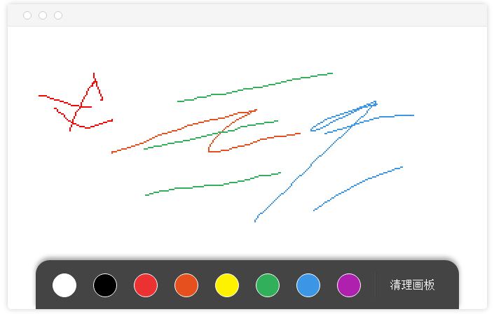

# demo-js-drawing 多人画图demo

demo-js-drawing 是一个使用Wilddog实现的画图示例。一端用户用在canvas上画图，笔画会实时传输到其他客户端，可以多人协作一起画图！


## 在线示例
http://drawing.wilddogapp.com/




## 本地运行
本地运行需要依赖node.js。
需要安装node.js和npm。

安装依赖：

```
cd demo-js-drawing
npm install -g grunt
npm install
```

启动http服务：

```
grunt serve
```

访问浏览器地址: http://127.0.0.1:9000/ 。


## 相关文档

* [Wilddog 概览](https://z.wilddog.com/overview/guide)
* [JavaScript SDK快速入门](https://z.wilddog.com/web/quickstart)
* [JavaScript SDK 开发向导](https://z.wilddog.com/web/guide/1)
* [JavaScript SDK API](https://z.wilddog.com/web/api)
* [下载页面](https://www.wilddog.com/download/)
* [Wilddog FAQ](https://z.wilddog.com/faq/qa)

## License
MIT
http://wilddog.mit-license.org/


## 感谢 Thanks

demo-js-drawing is built on and with the aid of several  projects. We would like to thank the following projects for helping us achieve our goals:

Open Source:

* [Firebase Drawing Example](https://www.firebase.com/tutorial/#example/drawing) 
* [JQuery](http://jquery.com) The Write Less, Do More, JavaScript Library.


